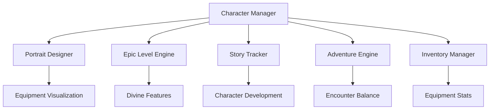

# AI Agent Implementation Master Guide

## 🎯 PROJECT OVERVIEW

**Project**: RulzLawyer D&D 3.5 Character Survival Game  
**Status**: Ready for AI Implementation  
**Implementation Guide**: [ULTIMATE-IMPLEMENTATION-GUIDE.md](../../ULTIMATE-IMPLEMENTATION-GUIDE.md)  
**Total Scope**: 117 story points, 71 weeks implementation time  

### 🚨 CRITICAL CODE PLACEMENT RULE
**ALL generated code MUST be placed exclusively in `code-repository/` folder**
- Never place code in root directory or other folders
- Follow the established structure in `code-repository/README.md`
- Reference: [Code Repository Guidelines](../../code-repository/README.md)

## 📋 IMPLEMENTATION PRIORITY MATRIX

### **PHASE 1: CRITICAL FOUNDATION SYSTEMS** (Weeks 1-24)
Implementation order for AI agents:

| Priority | System | Story Points | Implementation Guide | Code Location |
|----------|--------|--------------|---------------------|---------------|
| 1 | Portrait Designer | 8 | [ULTIMATE-IMPLEMENTATION-GUIDE.md#portrait-designer](../../ULTIMATE-IMPLEMENTATION-GUIDE.md) | `code-repository/src/portrait/` |
| 2 | Epic Level Engine | 13 | [ULTIMATE-IMPLEMENTATION-GUIDE.md#epic-level-engine](../../ULTIMATE-IMPLEMENTATION-GUIDE.md) | `code-repository/src/epic/` |
| 3 | Story Tracker | 21 | [ULTIMATE-IMPLEMENTATION-GUIDE.md#story-tracker](../../ULTIMATE-IMPLEMENTATION-GUIDE.md) | `code-repository/src/story/` |
| 4 | Adventure Engine | 23 | [adventure-engine.instructions.md](adventure-engine.instructions.md) | `code-repository/src/adventure/` |
| 5 | Character Creator | 18 | [character-creator.instructions.md](character-creator.instructions.md) | `code-repository/src/character/` |
| 6 | Inventory System | 15 | [inventory-management.instructions.md](inventory-management.instructions.md) | `code-repository/src/inventory/` |

### **PHASE 2: ENHANCED SYSTEMS** (Weeks 25-71)
| System | Story Points | Dependencies | Implementation Guide |
|--------|--------------|--------------|---------------------|
| Modern Gaming Interface | 12 | Portrait Designer, Character Creator | [ULTIMATE-IMPLEMENTATION-GUIDE.md#modern-interface](../../ULTIMATE-IMPLEMENTATION-GUIDE.md) |
| Server Architecture | 7 | All core systems | [server-architecture.instructions.md](server-architecture.instructions.md) |

## 🎲 SYSTEM INTEGRATION REQUIREMENTS

### **Core System Dependencies**


### **Data Flow Requirements**
- **Character Data**: Flows from Character Manager to all other systems
- **Equipment Data**: Syncs between Inventory and Portrait systems
- **Story Data**: Integrates with Adventure Engine for personalized content
- **Epic Data**: Updates Portrait for divine features and Adventure for cosmic challenges

## 🛠️ TECHNICAL SPECIFICATIONS

### **Architecture Standards**
```javascript
// Standard module pattern for all systems
class SystemName {
  constructor(dependencies, options = {}) {
    this.dependencies = dependencies;
    this.options = { defaults: true, ...options };
    this.initialized = false;
  }
  
  async initialize() {
    if (this.initialized) return;
    // System initialization
    this.initialized = true;
  }
}

// Required dual environment export
if (typeof module !== 'undefined' && module.exports) {
  module.exports = SystemName;
} else if (typeof window !== 'undefined') {
  window.SystemName = SystemName;
}
```

### **Performance Requirements**
- Character calculations: <100ms
- Portrait generation: <1 second
- Epic level advancement: <2 seconds
- Adventure generation: <30 seconds
- Memory usage: <500MB total system

### **D&D 3.5 SRD Compliance**
- 100% accuracy for all calculations
- Complete prerequisite validation
- Exact rule implementation from SRD
- Epic Level Handbook compliance for levels 21-100

## 📚 DOCUMENTATION CROSS-REFERENCES

### **Requirements Sources**
| Document | Purpose | Location |
|----------|---------|----------|
| [ULTIMATE-IMPLEMENTATION-GUIDE.md](../../ULTIMATE-IMPLEMENTATION-GUIDE.md) | Complete technical specifications | Root directory |
| [AGENTS.md](../../AGENTS.md) | Development instructions for AI agents | Root directory |
| [User Stories](../../user-stories/) | Feature requirements and acceptance criteria | user-stories/ folder |
| [Technical Specs](../../technical-specs/) | Detailed technical requirements | technical-specs/ folder |
| [Test Scenarios](../../test-scenarios/) | Validation and testing requirements | test-scenarios/ folder |

### **Implementation Guides**
| System | Primary Guide | Secondary References |
|--------|---------------|---------------------|
| Character Creator | [character-creator.instructions.md](character-creator.instructions.md) | [Character Requirements](../../requirements/dnd-character-creator-requirements.md) |
| Adventure Engine | [adventure-engine.instructions.md](adventure-engine.instructions.md) | [Adventure Requirements](../../requirements/adventure-engine-requirements.md) |
| Inventory System | [inventory-management.instructions.md](inventory-management.instructions.md) | [Inventory Requirements](../../requirements/inventory-management-system-requirements.md) |
| SRD Data | [srd-data-manager.instructions.md](srd-data-manager.instructions.md) | [SRD Database](../../code-repository/SRD/) |

## 🧪 TESTING AND VALIDATION

### **Testing Framework Requirements**
- Unit tests: 90%+ coverage for all systems
- Integration tests: Complete cross-system validation
- Performance tests: Meet all benchmark requirements
- SRD compliance tests: Validate all D&D calculations

### **Validation Checkpoints**
| System | Validation Criteria | Test Location |
|--------|-------------------|---------------|
| Character Creator | 7-step wizard completion, SRD accuracy | `code-repository/tests/character/` |
| Portrait Designer | All races generate correctly, equipment sync | `code-repository/tests/portrait/` |
| Epic Level Engine | Levels 21-100 progression, divine ascension | `code-repository/tests/epic/` |
| Story Tracker | Backstory generation, narrative coherence | `code-repository/tests/story/` |
| Adventure Engine | Balanced encounters, survival scaling | `code-repository/tests/adventure/` |

## 🚀 AI AGENT WORKFLOW

### **Pre-Implementation Checklist**
1. ✅ Read this master guide completely
2. ✅ Review specific system implementation guide
3. ✅ Study related user stories and requirements
4. ✅ Examine existing code in `code-repository/src/`
5. ✅ Plan code structure and dependencies

### **Implementation Process**
1. **Plan**: Use `manage_todo_list` tool for complex tasks
2. **Code**: Generate code in correct `code-repository/` location
3. **Test**: Create comprehensive tests in `code-repository/tests/`
4. **Validate**: Ensure SRD compliance and performance requirements
5. **Document**: Update API documentation and usage examples

### **Quality Assurance**
- Follow established architecture patterns
- Include comprehensive error handling
- Maintain dual browser/Node.js compatibility
- Validate against D&D 3.5 SRD rules
- Test complete user workflows

## 🎯 SUCCESS CRITERIA

### **System Completeness**
- All priority systems implemented and tested
- Complete D&D 3.5 character creation workflow
- Epic level progression (1-100) functional
- Character survival gameplay operational
- Cross-system integration validated

### **Quality Metrics**
- 95%+ test coverage across all systems
- <100ms response times for character operations
- 100% D&D 3.5 SRD rule compliance
- WCAG 2.1 AA accessibility compliance
- Modern browser compatibility (Chrome, Firefox, Safari, Edge)

## 📞 AGENT SUPPORT RESOURCES

### **Getting Started**
1. **New to Project**: Start with [AGENTS.md](../../AGENTS.md)
2. **Specific System**: Use system-specific `.instructions.md` files
3. **Technical Details**: Reference [ULTIMATE-IMPLEMENTATION-GUIDE.md](../../ULTIMATE-IMPLEMENTATION-GUIDE.md)
4. **Requirements**: Check relevant files in `requirements/`, `user-stories/`, `technical-specs/`

### **Common Issues**
- **Code Placement**: Always use `code-repository/` folder
- **Dependencies**: Check system integration requirements
- **Performance**: Meet specified benchmarks
- **Testing**: Include comprehensive test coverage
- **SRD Compliance**: Validate all D&D calculations

---

**Version**: 1.0  
**Last Updated**: September 22, 2025  
**Status**: Ready for AI Implementation  
**Next Action**: Begin with Portrait Designer System (Priority 1)